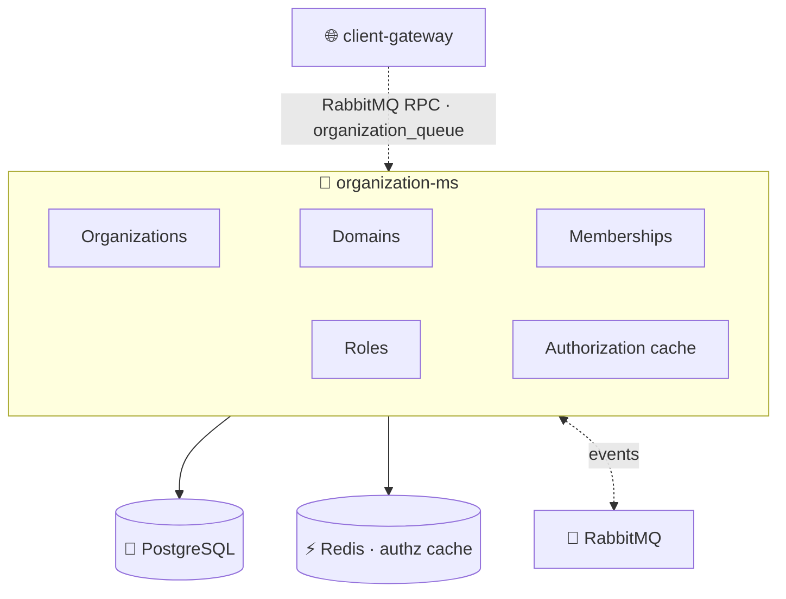
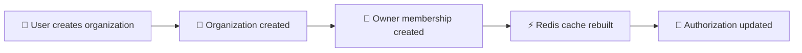
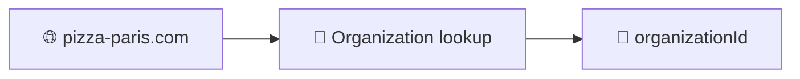

<h1 align="center">🏢 Organization Microservice · <code>organization-ms</code></h1>

<p align="center">
  <b>NestJS microservice</b> managing organizations, custom domains, memberships and role assignments<br/>
  in a multi-tenant ecosystem. <i>The foundation for ownership, permissions and tenant resolution.</i>
</p>

<p align="center">
  
  
  
  
  
</p>

<p align="center">
  
  
  
  
</p>

<br/>

## 🚀 Overview

`organization-ms` manages organization creation and lifecycle, custom domain registration, user memberships, organization roles, authorization cache generation, customer anonymization events and multi-tenant organization resolution.

> [!IMPORTANT]
> The service communicates **exclusively through RabbitMQ** and acts as the central source of truth for organization ownership and user access across the platform. Every service that requires organization context ultimately depends on data managed here.

<br/>

## 🏗️ Architecture



<br/>

## ✨ Features

Organization management · custom domain support · membership management · role assignment · multi-tenant architecture · authorization cache generation · event-driven communication · soft delete support · customer anonymization support · Redis-backed permission caching.

<br/>

## 🛠️ Tech Stack

| Category | Technology |
|---|---|
| Framework | NestJS 11 |
| Language | TypeScript 5 |
| Database | PostgreSQL |
| ORM | TypeORM |
| Messaging | RabbitMQ |
| Cache | Redis |
| Validation | class-validator |
| Environment validation | Zod |
| Testing | Jest |

<br/>

## ⚙️ Getting Started

**Prerequisites:** Node.js 20+, PostgreSQL, RabbitMQ, Redis.

```bash
npm install
cp .env.example .env
npm run start:dev
```

<details>
<summary><b>📜 Available scripts</b></summary>

<br/>

```bash
npm run build
npm run start        # start / start:dev / start:debug / start:prod
npm run lint
npm run format
npm test             # test / test:watch / test:cov
npm run test:e2e
```

</details>

<br/>

## 🌍 Environment Variables

| Variable | Required | Description |
|---|:---:|---|
| `NODE_ENV` | ✅ | Environment |
| `PORT` | ✅ | Service port |
| `DB_HOST` | ✅ | PostgreSQL host |
| `DB_PORT` | ✅ | PostgreSQL port |
| `POSTGRES_USER` | ✅ | Database user |
| `POSTGRES_PASSWORD` | ✅ | Database password |
| `POSTGRES_DB` | ✅ | Database name |
| `RABBITMQ_URL` | ✅ | RabbitMQ connection string |
| `RABBITMQ_QUEUE` | ✅ | Main queue |
| `RMQ_EVENTS_QUEUE_AUTHZ` | ✅ | Authorization events queue |
| `RMQ_EVENTS_QUEUE_ORGANIZATION` | ✅ | Organization events queue |
| `REDIS_HOST` | ✅ | Redis host |
| `REDIS_PORT` | ✅ | Redis port |
| `REDIS_PASS` | ✅ | Redis password |

<br/>

## 📨 RabbitMQ Patterns

Event patterns at a glance:

| Event | Description |
|---|---|
| `userOrganization.user_authz_refresh` | Refresh permissions |
| `customer.anonymized` | Remove customer data |

<details>
<summary><b>🏢 Organizations patterns</b></summary>

<br/>

| Pattern | Description |
|---|---|
| `organization.create` | Create organization |
| `organization.find_one` | Get organization |
| `organization.update` | Update organization |
| `organization.update_event` | Update via event |
| `organization.stripe.clear` | Remove Stripe account |
| `organization.delete` | Soft delete organization |

</details>

<details>
<summary><b>🌐 Organization Domains patterns</b></summary>

<br/>

| Pattern | Description |
|---|---|
| `organizationDomain.create` | Register domain |
| `organizationDomain.find_all` | List domains |
| `organizationDomain.find_one` | Resolve domain |
| `organizationDomain.update` | Update domain |
| `organizationDomain.delete` | Delete domain |

</details>

<details>
<summary><b>👥 User Organizations patterns</b></summary>

<br/>

| Pattern | Description |
|---|---|
| `userOrganization.create` | Create membership |
| `userOrganization.findAllOrganizationsByUser` | User organizations |
| `userOrganization.findAllUsersByOrganization` | Organization users |
| `userOrganization.update` | Update membership |
| `userOrganization.delete` | Soft delete membership |
| `userOrganization.restore` | Restore membership |

</details>

<br/>

## 🌐 Domain Management

Organizations can register one or more custom domains (e.g. `restaurant-a.com`, `restaurant-b.fr`, `app.myrestaurant.com`).

**Capabilities:** registration · validation · lookup · updates · deletion · tenant resolution. Domains are normalized to lowercase before storage.

<br/>

## 👥 Membership Management

Organizations can have multiple users with different roles — typically `OWNER`, `STAFF`, `CUSTOMER`.

**Features:** create memberships · update roles · soft delete · restore · list organization members · list user organizations.

<br/>

## 🔐 Authorization Cache

The service maintains a Redis cache of the organizations accessible by each user.

| | |
|---|---|
| **Cache key** | `user:<userId>:orgs` |
| **TTL** | `3600` seconds |

```json
[
  {
    "organizationId": "uuid",
    "role": "staff",
    "email": "user@email.com",
    "stripeAccountId": "acct_xxxxx"
  }
]
```

The cache rebuilds automatically when memberships are created, updated, deleted or restored, and when authorization-refresh events are received.



<br/>

## 🗄️ Database Entities

<details>
<summary><b>View all entities</b></summary>

<br/>

| Entity | Purpose | Main fields |
|---|---|---|
| **Organization** | A tenant organization | `id`, `name`, `ownerId`, `stripeAccountId`, `logoUrl`, `createdAt`, `updatedAt`, `deletedAt` |
| **OrganizationDomain** | A custom domain attached to an organization | `id`, `organizationId`, `domain` |
| **UserOrganization** | A membership between a user and an organization | `userId`, `organizationId`, `role`, `createdAt`, `updatedAt`, `deletedAt` |

- **Organization** — soft delete support, Stripe Connect integration, multi-domain support.
- **UserOrganization** — soft delete support, role assignment, cache synchronization.

</details>

<br/>

## 🔗 External Dependencies

| Dependency | Usage |
|---|---|
| 🐘 **PostgreSQL** | Stores organizations, domains, memberships |
| ⚡ **Redis** | Authorization cache + membership cache invalidation |
| 🐇 **RabbitMQ** | RPC + event-driven communication, authorization refresh, customer anonymization (listens on multiple queues) |

<br/>

## 🏢 Multi-Tenant Resolution

Tenant resolution is performed through organization domains, allowing multiple organizations to share the same platform while keeping complete data isolation:



<br/>

## ⚠️ Development Notes / Limitations

> [!WARNING]
> Tracked openly and worth verifying before production.

- **Unused patterns:** `organization.find_all` and `organization.restore` exist in constants but currently have no handlers.
- **Package name mismatch:** the folder is `organization-ms` but the `package.json` name is `membership-ms` — should be standardized.
- **Env example:** `.env.example` is missing `REDIS_PASS`, which the application requires at startup.
- **Testing:** Jest configuration and test scripts exist, but no active test files are present.
- **RabbitMQ client:** a payments event client is registered but currently unused by the application.

<br/>

## 📈 Service Scope

The organizational backbone of the platform — organization lifecycle management, domain ownership, user memberships, role management, authorization caching and multi-tenant resolution.

<p align="center">
  
</p>